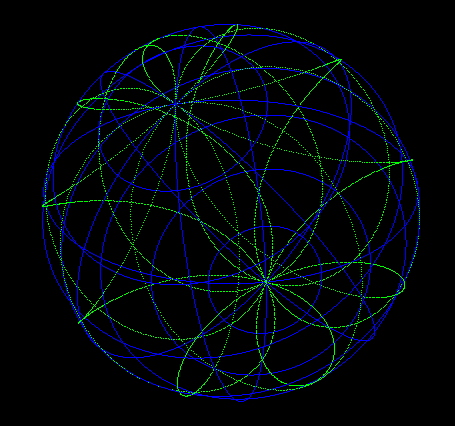
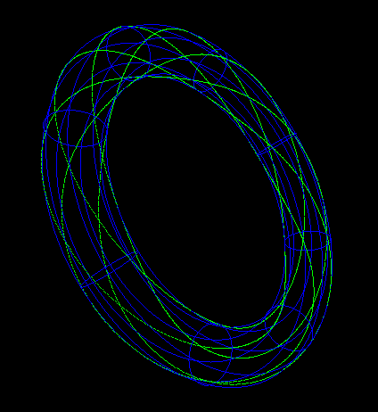

# Project README

## Build and Run

This project provides multiple ways to build and run the code:

- **Using CMake**:
  - Run [`build_and_run.sh`](build_and_run.sh) to build and execute the project.
  - Use [`cmake_clean_build.sh`](cmake_clean_build.sh) to clean and rebuild the project from scratch.
- **Using Clang directly**:
  - Use [`clang_clean_build.sh`](clang_clean_build.sh) to compile with Clang.
- **Debugging**:
  - For interactive debugging, press **F5** in your IDE.
  - Terminal-based debugging is supported with [`lldb_debug.sh`](lldb_debug.sh).

## Test

- Testing is managed with **CTest**.
- The [`test_main.cpp`](test_main.cpp) file contains an example test case.
- Note: Currently, there are no significant tests implemented.
- For memory leak detection, use the [`asan_leak_check.sh`](asan_leak_check.sh) script.

## View

- The C++ code generates a JSON output file at **`viewer/public/output/view_data.json`** (outside git).
- The Vite web server processes this file and uses it in [`viewer/viewer_plot_data.js`](viewer/viewer_plot_data.js) to render visualizations.
- Example views 

## Content

- The main entry point of the project is [`main.cpp`](main.cpp).
- The project explores three key areas of lower-level code:
  1. [`std_explore`](std_explore): Examples using standard library classes, focusing on performance comparisons of standard collections.
  2. [`boost_explore`](boost_explore): Examples using Boost classes, with emphasis on the `optional` class.
  3. [`geom_explore`](geom_explore): Examples using OpenCascade for geometric operations.
